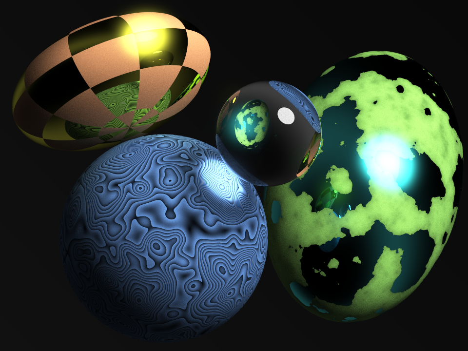

# Photon.rs

Photon.rs is a Rust ray tracing (or path tracing) library that could be used to produce realistic 3D images. I started 
writing this library in Java at first (see the [Photon](https://github.com/ghadeeras/photon) project) to exercise the 
concepts learned from the [Ray Tracing in One Weekend](https://raytracing.github.io) book series. I started porting it 
to Rust as a way for me to practice the language. It is still so much a work in progress.

Examples of images generated by this library could be found 
[here](https://github.com/ghadeeras/photon.rs/tree/main/images). This is one such example:

The above example was generated using this [code](https://github.com/ghadeeras/photon.rs/blob/main/examples/example2.rs)
(or a close variant of it).

So far, little effort has been done to improve its performance. The focus currently is on having a clean design, and to 
grasp the concepts gleaned from the aforementioned book.
